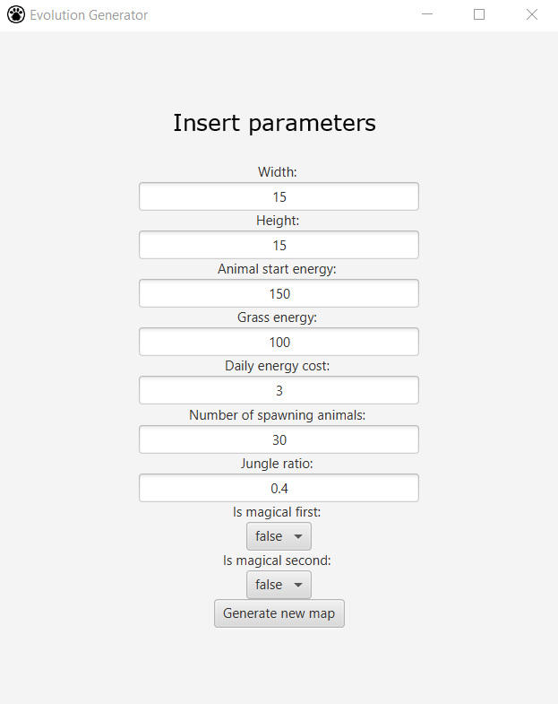
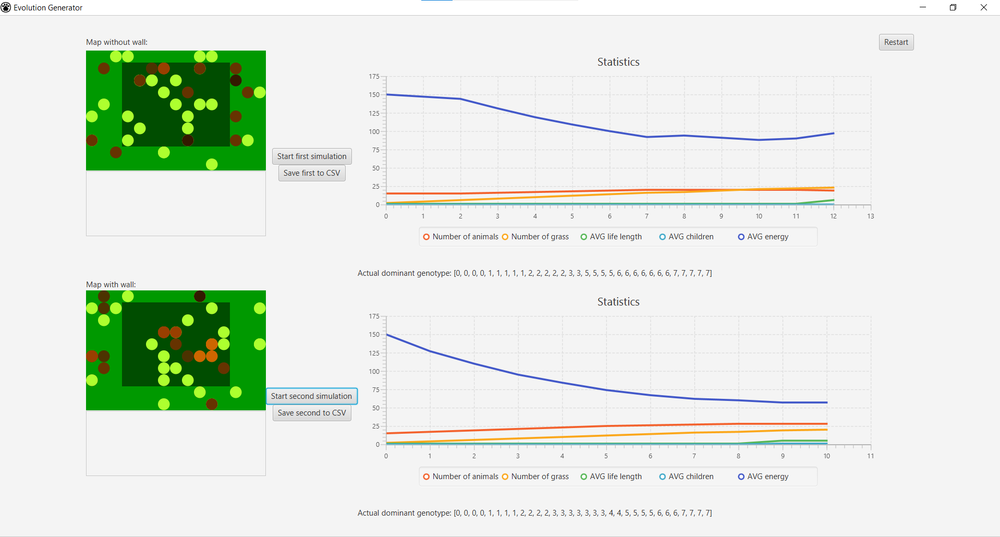
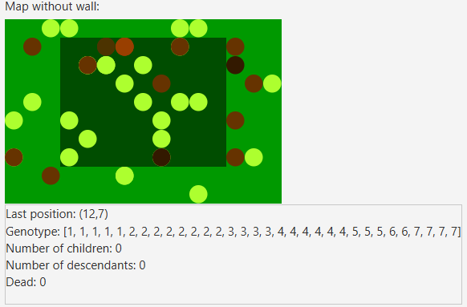

# Generator ewolucyjny

### Opis
Projekt symuluje środowisko dżungli i stepów ze zwierzętami, które mogą się poruszać, jeść oraz rozmnażać. W trakcie grommadzone są statystyki dotyczące całej symulacji.
### Mapa
Świat składa się z płaszczyzny, po której przemieszczają się zwierzęta. Większość z niej jest stepem. Na środku znajduje się fragment dżungli, gdzie trawa rośnie szybciej. Są dostępne dwa rodzaje mapy:
1. z zawiniętymi brzegami - zwierzęta przechodzą na przeciwną stronę granicy
2. z brzegami stanowiącymi mur - zwierzęta nie mogą przekroczyć granicy
### Zwierzęta
Zwierzęta mają określony genotyp, składający się z 32 genów (liczb z zakresu 0-7). Reprezentuje on preferencje określonych ruchów lub obrotów. Podczas przemieszczania zwierzęta zjadają rośliny z danego pola, zyskując przy tym energię.

Aby się rozmnażać:
* na zwierzęta muszą się spotkać na jednym polu
* muszą być zdrowe (posiadać przynajmniej 25% początkowej energii każde)

Nowo powstałe zwierze dostaje genotyp utworzony na podstawie genotypów rodziców.

### Pozostałe
Szczegółowe wymagania zastosowane przy tworzeniu projektu zostały opisane poniżej:

https://github.com/apohllo/obiektowe-lab/tree/master/proj1

### Działanie programu
Na początku możliwe jest ustalenie parametrów startowych:



Utworzone zostały dwie opisane wcześniej mapy. Każdą z nich można uruchomić niezależnie.
Obok znajdują się wykresy ze statystykami.

Trawę symbolizują koła w kolorze zielonym, a zwierzęta (w zależności od posiadanej energii) koła brązowe.


Po uruchomieniu wyświetla się także genotyp, który dominuje podczas danego dnia.



Po wskazaniu danego zwierzęcia, możemy zobaczyć i śledzić jego dane: ostatnio zajmowaną pozycję, genotyp, liczbę dzieci, liczbę potomków. Jeśli zwierzę umrze to zostanie wpisany dzień jego śmierci.



Dane statystyczne można zapisać do pliku w formacie CSV. Przykład zapisu:
```
Day,Number of animals,Number of grass,AVG Energy,AVG life length,AVG owned children
0,30,2,150,1,0
1,39,4,108,1,0
2,49,5,83,1,0
3,62,7,60,1,1
4,75,6,47,1,1
5,86,6,39,1,1
6,99,6,30,1,1
7,105,6,26,1,1
8,107,6,22,1,1
9,108,6,19,1,1
10,107,5,18,6,1
11,95,5,18,5,1
12,86,5,16,5,1
13,76,6,15,5,2
14,66,5,16,5,2
15,56,5,19,5,2
16,38,5,26,5,2
17,28,6,31,5,2
18,23,8,34,5,3
19,20,9,41,5,2
End: ,71,5,43,3,1
```